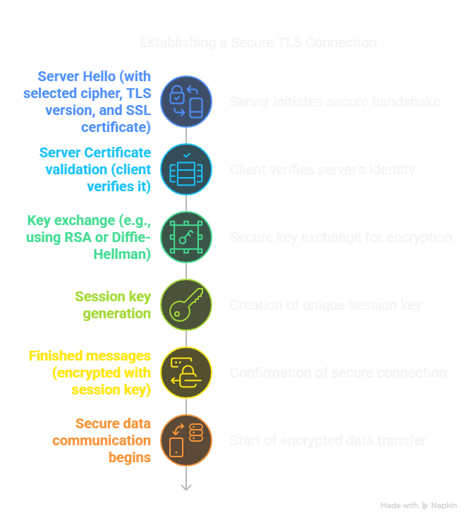
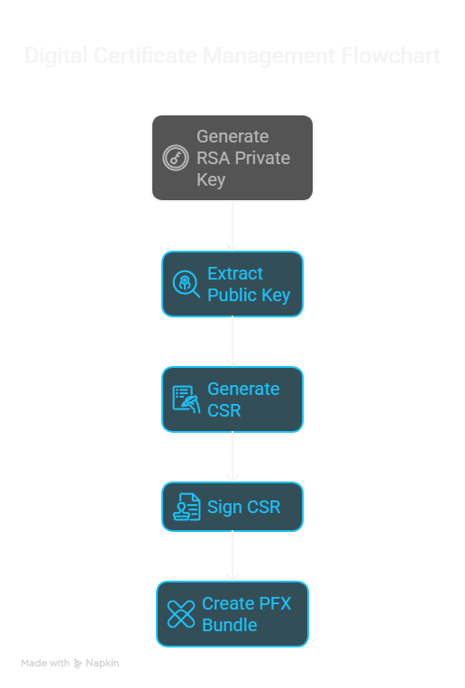

# 🛡️ Create Your Own Certificate Authority (CA) and SSL Certificates for Local HTTPS

## 🧠 Understanding SSL/TLS and Certificates

### 📌 What is SSL/TLS?
SSL (Secure Sockets Layer) and TLS (Transport Layer Security) are cryptographic protocols that provide secure communication over a network.

### 📌 What is a Certificate Authority (CA)?
A Certificate Authority is a trusted entity that issues digital certificates. These certificates verify that a public key belongs to an individual, organization, or device.

### 📌 Self-Signed vs CA-Signed Certificates
- **Self-Signed Certificate**: Signed with your own private key. Suitable for development.
- **CA-Signed Certificate**: Signed by a trusted CA. Suitable for production environments.

### 📌 Diagram: SSL Certificate Flow (Client ↔️ Server Communication)


## ⚙️ Prerequisites

1. **OpenSSL** must be installed:
   - [Install OpenSSL (StackOverflow guide)](https://stackoverflow.com/a/51757939/1273882)
   - On Windows, add `C:\Program Files\Git\usr\bin` to your PATH environment variable

---

## 🔐 Key Concepts

### 📁 File Types
- **`.key`**: Contains the private key (used to sign or decrypt data).
- **`.csr`**: Certificate Signing Request (contains public key + metadata).
- **`.crt` / `.pem`**: Final certificate, signed using CA.
- **`.pfx`**: Combined file (Private Key + Certificate), usually for web servers.

### 🛠️ Useful Commands
| Command | Purpose |
|--------|---------|
| `openssl genrsa` | Generate RSA private key |
| `openssl rsa -pubout` | Extract public key from private key |
| `openssl req` | Generate CSR or self-signed cert |
| `openssl x509` | Sign CSR using CA private key |
| `openssl pkcs12` | Create a PFX bundle |



---

## 🏗️ Step-by-Step Guide to Set Up Local Certificate Authority

### 1. Install OpenSSL
1. Download OpenSSL for Windows from [https://slproweb.com/products/Win32OpenSSL.html](https://slproweb.com/products/Win32OpenSSL.html)
   - Choose the Win64 OpenSSL v1.1.1 or newer version
   - Run the installer and follow the prompts

2. Add OpenSSL to your PATH environment variable:
   - Right-click My Computer → Properties → Advanced System Settings → Environment Variables
   - Edit the "Path" variable under System Variables
   - Add `C:\Program Files\OpenSSL-Win64\bin` (or your installation path)
   - Click OK to save changes

3. Verify installation by opening PowerShell and running:
   ```powershell
   openssl version
   ```
   You should see output similar to: `OpenSSL 1.1.1q 5 Jul 2022`

### 2. Create a Working Directory
```powershell
# Create directory for certificates
New-Item -ItemType Directory -Path C:\certs -Force
Set-Location -Path C:\certs
```

## Creating Your Certificate Authority (CA)

### Step 1: Set Variable for CA Name
```powershell
$CANAME = "YourOrg-RootCA"
```
Replace "YourOrg-RootCA" with your preferred CA name (e.g., "MyCompany-RootCA")

### Step 2: Generate the CA Private Key
```powershell
openssl genrsa -aes256 -out "${CANAME}.key" 4096
```
**Important**: When prompted, enter a strong passphrase for your CA private key. Remember this passphrase as you'll need it later.

### Step 3: Create the Root CA Certificate
```powershell
openssl req -x509 -new -nodes -key "${CANAME}.key" -sha256 -days 1826 -out "${CANAME}.crt"
```
You'll be prompted for your passphrase and certificate information:
- Country Name (2 letter code): US (or your country code)
- State or Province: Your State
- Locality Name: Your City
- Organization Name: Your Organization
- Organizational Unit: Your Department
- Common Name: YourOrg Root CA (important: use a descriptive name for your CA)
- Email Address: admin@example.com

### Step 4: Verify Your CA Certificate
```powershell
openssl x509 -in "${CANAME}.crt" -text -noout
```
This displays your certificate details. Verify:
- Issuer and Subject should match
- "CA:TRUE" appears in the Basic Constraints section

## Installing Your Root CA Certificate

### Add to Windows Trusted Root CA Store:
1. Navigate to your certificate directory and double-click on your CA certificate file (`YourOrg-RootCA.crt`)
2. Click "Install Certificate"
3. Select "Local Machine" (requires admin privileges)
4. Click "Next"
5. Select "Place all certificates in the following store"
6. Click "Browse" and select "Trusted Root Certification Authorities"
7. Click "Next" then "Finish"
8. You should see a confirmation message "The import was successful"

### Verify Installation:
```powershell
# Run as administrator
Start-Process certmgr.msc
```
Navigate to "Trusted Root Certification Authorities" → "Certificates" and confirm your CA is listed.

## Creating Server SSL Certificates

### Step 1: Set Server Certificate Name
```powershell
$SERVERNAME = "myserver"
```
Replace "myserver" with your preferred server name.

### Step 2: Create Server Private Key and CSR
```powershell
openssl req -new -nodes -out "${SERVERNAME}.csr" -newkey rsa:2048 -keyout "${SERVERNAME}.key"
```
When prompted for certificate information:
- Common Name: Your server's domain name (e.g., myserver.local)
- Complete other fields as appropriate

### Step 3: Create SAN Configuration File
Create a file named `server_ext.cnf` in your working directory with the following content:

```
authorityKeyIdentifier=keyid,issuer
basicConstraints=CA:FALSE
keyUsage = digitalSignature, nonRepudiation, keyEncipherment, dataEncipherment
extendedKeyUsage = serverAuth
subjectAltName = @alt_names

[alt_names]
DNS.1 = myserver.local
DNS.2 = localhost
DNS.3 = *.myserver.local
IP.1 = 127.0.0.1
IP.2 = 192.168.1.10
```

You can create this file using PowerShell:
```powershell
$sanConfig = @"
authorityKeyIdentifier=keyid,issuer
basicConstraints=CA:FALSE
keyUsage = digitalSignature, nonRepudiation, keyEncipherment, dataEncipherment
extendedKeyUsage = serverAuth
subjectAltName = @alt_names

[alt_names]
DNS.1 = myserver.local
DNS.2 = localhost
DNS.3 = *.myserver.local
IP.1 = 127.0.0.1
IP.2 = 192.168.1.10
"@

$sanConfig | Out-File -FilePath "server_ext.cnf" -Encoding ascii
```

**Important**: Customize the DNS and IP entries according to your specific needs.

### Step 4: Sign the Server Certificate
```powershell
openssl x509 -req -in "${SERVERNAME}.csr" -CA "${CANAME}.crt" -CAkey "${CANAME}.key" -CAcreateserial -out "${SERVERNAME}.crt" -days 365 -sha256 -extfile server_ext.cnf
```

You'll be prompted for your CA key passphrase.

### Step 5: Verify the Server Certificate
```powershell
openssl x509 -in "${SERVERNAME}.crt" -text -noout
```

Verify:
- Issuer matches your CA's details
- Subject contains your server details
- Subject Alternative Name section lists your domains and IPs
- Basic Constraints shows "CA:FALSE"

## Converting Certificate Formats

### Create PFX/PKCS#12 Bundle
```powershell
openssl pkcs12 -export -out "${SERVERNAME}.pfx" -inkey "${SERVERNAME}.key" -in "${SERVERNAME}.crt" -certfile "${CANAME}.crt"
```

You'll be prompted to create a password for the PFX file.

### Extract Private Key from PFX
```powershell
openssl pkcs12 -in "${SERVERNAME}.pfx" -nocerts -out "${SERVERNAME}-extracted.key" -nodes
```

### Extract Certificate from PFX
```powershell
openssl pkcs12 -in "${SERVERNAME}.pfx" -nokeys -out "${SERVERNAME}-extracted.crt"
```

## Configuring Your Local Environment

### Add Entry to Hosts File
1. Open PowerShell as Administrator
2. Add entry to hosts file:
```powershell
Add-Content -Path C:\Windows\System32\drivers\etc\hosts -Value "`n127.0.0.1`tmyserver.local" -Force
```

## Configuring Web Servers

### ASP.NET Core Example
```csharp
var builder = WebApplication.CreateBuilder(args);

// Add HTTPS configuration
builder.WebHost.ConfigureKestrel(serverOptions =>
{
    serverOptions.ListenAnyIP(5001, listenOptions =>
    {
        listenOptions.UseHttps(options =>
        {
            options.AllowAnyClientCertificate();
            options.CheckCertificateRevocation = false;
            options.ServerCertificateSelector = (connectionContext, name) =>
            {
                return new X509Certificate2("path/to/myserver.pfx", "your-pfx-password");
            };
        });
    });
});

var app = builder.Build();
// ... rest of your app configuration
app.Run();
```

### IIS Configuration
1. Import the PFX file:
   - Open IIS Manager (run `inetmgr` as administrator)
   - Select your server in the left panel
   - Double-click "Server Certificates"
   - Click "Import" in the right-hand actions panel
   - Browse to your PFX file, enter the password, and complete the import

2. Configure HTTPS binding:
   - Select your website in the left panel
   - Click "Bindings" in the right-hand actions panel
   - Click "Add"
   - Set Type to "https"
   - Select your imported certificate
   - Set Host name to your domain (e.g., myserver.local)
   - Click "OK"

## Troubleshooting

### "req: Option -out needs a value" Error
This error occurs when PowerShell doesn't correctly pass the variable to OpenSSL. Solutions:

1. Use explicit variable expansion with curly braces:
```powershell
openssl req -x509 -new -nodes -key "${CANAME}.key" -sha256 -days 1826 -out "${CANAME}.crt"
```

2. Use direct file names instead of variables:
```powershell
openssl req -x509 -new -nodes -key "YourOrg-RootCA.key" -sha256 -days 1826 -out "YourOrg-RootCA.crt"
```

### "Unable to load CA Private Key" Error
This occurs if you entered the wrong passphrase. Try again and ensure you're using the correct passphrase.

### "Error Loading extension section" Error
This happens when the extension file isn't found or has format issues:
1. Verify the path to `server_ext.cnf` is correct
2. Ensure the file uses ASCII encoding (not Unicode)
3. Check for syntax errors in the file

### Certificate Not Trusted in Browser
1. Ensure your CA certificate is properly installed in the Trusted Root store
2. Restart your browser
3. Verify your server certificate was correctly signed by your CA:
```powershell
openssl verify -CAfile "${CANAME}.crt" "${SERVERNAME}.crt"
```

### Name Mismatch Errors
Ensure the domain name you're using to access the site is included in the SAN section of your certificate.

## Complete PowerShell Commands Summary

```powershell
# Set variables
$CANAME = "YourOrg-RootCA"
$SERVERNAME = "myserver"

# Create directory
New-Item -ItemType Directory -Path C:\certs -Force
Set-Location -Path C:\certs

# Generate CA key and certificate
openssl genrsa -aes256 -out "${CANAME}.key" 4096
openssl req -x509 -new -nodes -key "${CANAME}.key" -sha256 -days 1826 -out "${CANAME}.crt"

# Create server certificate
openssl req -new -nodes -out "${SERVERNAME}.csr" -newkey rsa:2048 -keyout "${SERVERNAME}.key"

# Create SAN config
$sanConfig = @"
authorityKeyIdentifier=keyid,issuer
basicConstraints=CA:FALSE
keyUsage = digitalSignature, nonRepudiation, keyEncipherment, dataEncipherment
extendedKeyUsage = serverAuth
subjectAltName = @alt_names

[alt_names]
DNS.1 = myserver.local
DNS.2 = localhost
DNS.3 = *.myserver.local
IP.1 = 127.0.0.1
IP.2 = 192.168.1.10
"@

$sanConfig | Out-File -FilePath "server_ext.cnf" -Encoding ascii

# Sign the certificate
openssl x509 -req -in "${SERVERNAME}.csr" -CA "${CANAME}.crt" -CAkey "${CANAME}.key" -CAcreateserial -out "${SERVERNAME}.crt" -days 365 -sha256 -extfile server_ext.cnf

# Create PFX bundle
openssl pkcs12 -export -out "${SERVERNAME}.pfx" -inkey "${SERVERNAME}.key" -in "${SERVERNAME}.crt" -certfile "${CANAME}.crt"

# Add to hosts file (run as administrator)
Add-Content -Path C:\Windows\System32\drivers\etc\hosts -Value "`n127.0.0.1`tmyserver.local" -Force
```
---

## 🧪 Example Use Case: Local Development on `https://myserver.local`

1. Add `127.0.0.1 myserver.local` to your `hosts` file
2. Create and trust your Root CA
3. Create and sign SSL cert for `myserver.local`
4. Run your server (ASP.NET, Node.js, etc.) using the cert
5. Test HTTPS connection in the browser

---

## 🔗 References

1. [OpenSSL genrsa](https://www.openssl.org/docs/man1.1.1/man1/openssl-genrsa.html)
2. [OpenSSL req](https://www.openssl.org/docs/man1.0.2/man1/openssl-req.html)
3. [Extract public key from private](https://security.stackexchange.com/a/172277)
