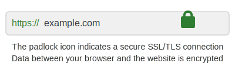
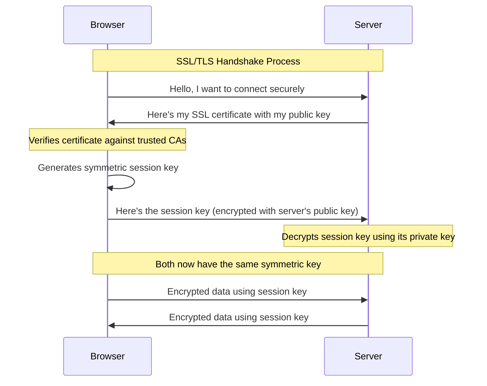
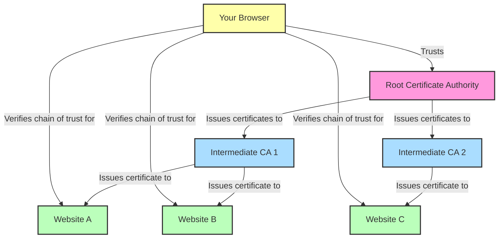

# SSL/TLS Explained: Keeping Your Data Safe Online

## Introduction

Every time you see that little padlock in your browser's address bar, SSL/TLS is working behind the scenes to protect your data. But how exactly does it work? This guide breaks down the complex world of web encryption into understandable concepts.




## The Problem: The Internet is Naturally Insecure

When you send information over the internet without encryption:

- Anyone between you and the website can **see your data** (like usernames, passwords, credit card numbers)
- Data can be **intercepted and modified** without you knowing
- You can't be sure you're connecting to the **genuine website** (not an impostor)

Think of it like sending a postcard through the mail - anyone handling it can read what's written on it.

## The Solution: SSL/TLS Encryption

SSL (Secure Sockets Layer) and its successor TLS (Transport Layer Security) solve these problems by:

1. **Encrypting data** so only the intended recipient can read it
2. Ensuring **data integrity** so no one can tamper with your information
3. Providing **authentication** so you know you're connecting to the genuine website

## How SSL/TLS Works: The Simple Version

1. **Your browser connects** to a secure website (HTTPS)
2. The website sends its **SSL certificate** (like a digital ID card)
3. Your browser **checks if the certificate is valid**
4. Your browser and the website **agree on a secret code**
5. All further communication is **encrypted** using this secret code

## The SSL Handshake Process

The diagram below shows exactly what happens when you connect to a secure website:



## Encryption Types: The Two Approaches

### Symmetric vs. Asymmetric Encryption

```mermaid
graph TD
    subgraph "Symmetric Encryption"
        A1[Original Data] -->|Encrypt with Key| B1[Encrypted Data]
        B1 -->|Decrypt with SAME Key| C1[Original Data]
        D1[Same Key] -->|Used for| A1
        D1 -->|Used for| B1
    end
    
    subgraph "Asymmetric Encryption"
        A2[Original Data] -->|Encrypt with Public Key| B2[Encrypted Data]
        B2 -->|Decrypt with Private Key| C2[Original Data]
        D2[Public Key] -->|Used for encryption| A2
        E2[Private Key] -->|Used for decryption| B2
    end

    style A1 fill:#f9f,stroke:#333,stroke-width:2px
    style C1 fill:#f9f,stroke:#333,stroke-width:2px
    style A2 fill:#f9f,stroke:#333,stroke-width:2px
    style C2 fill:#f9f,stroke:#333,stroke-width:2px
    style B1 fill:#bbf,stroke:#333,stroke-width:2px
    style B2 fill:#bbf,stroke:#333,stroke-width:2px
    style D1 fill:#bfb,stroke:#333,stroke-width:2px
    style D2 fill:#bfb,stroke:#333,stroke-width:2px
    style E2 fill:#fbf,stroke:#333,stroke-width:2px
```



### Symmetric Encryption
- **One Key** is used to both encrypt and decrypt data.
- **Fast**, but **key sharing is risky**.
- Example: AES (Advanced Encryption Standard).

### Asymmetric Encryption
- Uses **two keys**: a **Public Key** and a **Private Key**.
- Public Key **encrypts** the data, Private Key **decrypts** it.
- Example: RSA.

## The Clever Hybrid Approach

SSL/TLS uses **both types** of encryption:
1. Asymmetric encryption to **exchange a symmetric key securely**
2. Then faster symmetric encryption for **all remaining communication**

This gives you the best of both worlds: security and speed!

## What are Public and Private Keys?

- **Public Key:** Can be shared with anyone.
- **Private Key:** Must be kept secret.

**How they work together:**
- Anything encrypted with the Public Key can only be decrypted with the Private Key.
- Anything encrypted with the Private Key can be verified using the Public Key (for signatures).

## What is an SSL Certificate?

An **SSL Certificate** is a digital file that contains:
- Public Key.
- Website's information.
- Digital Signature of a Certificate Authority (CA).

**Purpose:** Prove the website is genuine and provide the Public Key for secure communication.

## The Certificate Authority (CA) System



How do we know a website is genuine? This is where Certificate Authorities come in.

### What is a Certificate Authority?
- Trusted third-party organizations that issue SSL certificates
- Built into your browser/operating system as "trusted roots"
- Examples: Let's Encrypt, DigiCert, GlobalSign, Comodo

### How the Trust System Works:
1. Website owner requests a certificate from a CA
2. CA verifies the website owner's identity and domain ownership
3. CA issues a digitally signed certificate
4. Your browser trusts certificates signed by these authorities

Think of it like a passport system:
- The CA is like a government passport office
- The certificate is like a passport
- Your browser checks if the passport (certificate) was issued by a trusted government (CA)

## Real-World Example: Bank Website Login

Let's walk through what happens when you visit your bank's website:

### Step 1: Initial Connection
You type `https://mybank.com` in your browser.

### Step 2: Certificate Exchange
The bank's server sends its SSL certificate containing:
- The bank's public key
- The bank's identity information
- Digital signature from a trusted Certificate Authority

### Step 3: Certificate Verification
Your browser checks:
- Is the certificate issued by a trusted authority?
- Is it still valid (not expired)?
- Does the domain name match?
- Has it been revoked?

### Step 4: Key Exchange
1. Your browser generates a random symmetric key (session key)
2. It encrypts this key using the bank's public key
3. Only the bank's server can decrypt it (using their private key)

### Step 5: Secure Communication
Now both sides have the same symmetric key to encrypt and decrypt all data for this session.

## Visual Representation: The SSL Handshake

```
┌─────────────┐                                  ┌─────────────┐
│             │                                  │             │
│   Browser   │                                  │   Server    │
│             │                                  │             │
└──────┬──────┘                                  └──────┬──────┘
       │                                                │
       │  Hello, I want to connect securely!           │
       │───────────────────────────────────────────────►
       │                                                │
       │  Here's my certificate with my public key     │
       │◄───────────────────────────────────────────────
       │                                                │
       │  [Verifies certificate]                        │
       │                                                │
       │  Here's a symmetric key I generated           │
       │  (encrypted with your public key)             │
       │───────────────────────────────────────────────►
       │                                                │
       │                        [Decrypts with private key]
       │                                                │
       │         Now both sides have the same symmetric key!
       │                                                │
       │◄═══════════════ENCRYPTED DATA════════════════►│
       │                                                │
```

## Types of SSL Certificates

### Domain Validation (DV)
- Basic verification (just proves domain ownership)
- Fast to obtain (minutes to hours)
- Shows as a padlock in browsers
- Good for: Personal blogs, simple websites

### Organization Validation (OV)
- Moderate verification (verifies organization details)
- Takes days to obtain
- Shows as a padlock in browsers
- Good for: Business websites

### Extended Validation (EV)
- Rigorous verification process
- Takes weeks to obtain
- Previously showed organization name in green address bar (most browsers have removed this)
- Good for: Banks, e-commerce, sites handling sensitive information

## Common SSL Certificate Issues

### Certificate Not Trusted
- The certificate was issued by an untrusted CA
- The root certificate is not in your browser's trust store

### Certificate Expired
- All certificates have an expiration date (typically 1-2 years)
- Website owner forgot to renew

### Certificate Name Mismatch
- Certificate was issued for a different domain
- E.g., Certificate for `www.example.com` won't work for `example.com`

### Self-Signed Certificate
- Certificate created by the website owner, not a trusted CA
- No third-party verification

## Troubleshooting SSL Errors (For Website Owners)

If your website shows SSL errors:

1. **Check certificate expiration** - Renew if needed
2. **Verify domain names match** - Certificate should cover all variants of your domain
3. **Install intermediate certificates** - Sometimes the "chain" is incomplete
4. **Test your SSL setup** - Use tools like SSL Labs Server Test
5. **Check mixed content** - Ensure all resources load over HTTPS

## SSL/TLS Versions

| Version | Released | Status | Key Features/Issues |
|---------|----------|--------|---------------------|
| SSL 1.0 | Never released | Abandoned | Internal only |
| SSL 2.0 | 1995 | Deprecated | Serious security flaws |
| SSL 3.0 | 1996 | Deprecated | Vulnerable to POODLE attack |
| TLS 1.0 | 1999 | Deprecated | Vulnerable to BEAST attack |
| TLS 1.1 | 2006 | Deprecated | Vulnerable to BEAST attack |
| TLS 1.2 | 2008 | Widely used | Current minimum standard |
| TLS 1.3 | 2018 | Modern | Faster, more secure |

Modern websites should use TLS 1.2 or TLS 1.3 only.

## How to Implement SSL on Your Website

### Option 1: Let's Encrypt (Free)
1. Install a client like Certbot
2. Run the client to obtain certificate
3. Configure your web server
4. Set up auto-renewal

### Option 2: Paid Certificate Authority
1. Generate a Certificate Signing Request (CSR)
2. Purchase certificate from a CA
3. Complete validation
4. Install the certificate on your server

### Option 3: Through Hosting Provider
Many web hosts offer one-click SSL installation through their control panel.

## Testing Your SSL Implementation

Use these tools to verify your setup:
- [SSL Labs Server Test](https://www.ssllabs.com/ssltest/)
- [Mozilla Observatory](https://observatory.mozilla.org/)
- [ImmuniWeb SSL Security Test](https://www.immuniweb.com/ssl/)

## Conclusion

SSL/TLS technology forms the backbone of internet security. While the technical details are complex, the basic concept is simple: encrypt data in transit to protect it from prying eyes and ensure website authenticity.

By implementing proper SSL/TLS on your website, you're not just following best practices—you're actively protecting your users and building trust in your digital presence.

## Resources for Further Learning

- [Mozilla SSL Configuration Generator](https://ssl-config.mozilla.org/)
- [Let's Encrypt Documentation](https://letsencrypt.org/docs/)
- [SSL Shopper Tools](https://www.sslshopper.com/ssl-tools.html)
- [Cloudflare SSL Guide](https://www.cloudflare.com/learning/ssl/what-is-ssl/)
